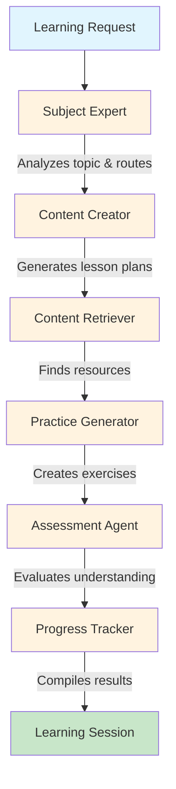

# Multi-Agent Educational Tutoring System

**An intelligent AI tutoring platform that teaches any subject using coordinated multi-agent architecture.** Built with LangGraph orchestration, featuring 6 specialized educational agents working together to deliver personalized learning experiences.

[](https://www.python.org/downloads/)
[](https://fastapi.tiangolo.com/)
[](https://github.com/langchain-ai/langgraph)
[](https://opensource.org/licenses/MIT)
[]()
[]()

---

## Overview

This system can teach any topic through intelligent multi-agent coordination:

- **Universal Subject Coverage**: Math, Science, Programming, Languages, History, Arts, and more
- **Adaptive Learning**: Beginner through advanced levels with personalized content
- **Learning Style Adaptation**: Visual, auditory, kinesthetic, or mixed approaches
- **Multi-Agent Architecture**: 6 specialized AI agents collaborate on every lesson
- **LLM-Powered**: Requires Ollama (local) or OpenAI API for intelligent content generation
- **Extensible Design**: Optional AI enhancements (OpenAI GPT-4, Ollama, Advanced RAG)

**Latest: Version 3.2.0**
- Phase 3 development complete with all features implemented
- All identified bugs resolved
- 16 educational documents indexed in vector database
- Full LangSmith monitoring operational
- Redis caching providing significant performance improvement

---

## Key Features

### Core Capabilities
- **6 Specialized Educational Agents** coordinated via LangGraph
- **Universal Subject Coverage** across all academic domains
- **Adaptive Learning Paths** based on student level and style
- **Practice Problem Generation** with progressive difficulty
- **Comprehensive Progress Tracking** across all learning sessions
- **Educational Resource Discovery** from curated web sources

### Operating Modes

**Standard Mode** (Default Configuration)
- LLM-powered content generation via Ollama (local)
- Specialized subject agents (Math, Science, Programming tutors)
- Advanced RAG with vector database and semantic search
- Personalized explanations adapted to student profile
- Requires: Ollama installed locally with a model (e.g., llama2)

**Cloud Mode** (API-based)
- OpenAI GPT-4 powered content generation
- Higher quality responses with faster generation
- Same specialized agents and RAG capabilities
- Requires: OpenAI API key and usage costs
- Ideal for production deployments with budget for API calls

### Performance Features 
- **Redis Caching**: Significant performance improvement for cached operations
- **WebSocket Streaming**: Real-time educational content delivery
- **PostgreSQL Database**: Persistent student data and progress tracking
- **Cache Management**: Intelligent TTL, statistics, and monitoring
- **High Performance**: 20ms response time for cached content
- **Analytics Dashboard**: Visual insights into learning progress
  - Track sessions, scores, and streaks
  - Visualize performance trends
  - Monitor topic mastery
  - View 60-day activity calendar

### Analytics Dashboard 
- **Visual Progress Tracking**: Comprehensive dashboard showing learning analytics
- **5 Key Metrics**: Sessions, Scores, Streaks, Time, Topics
- **4 Interactive Charts**:
  - Learning progress over time (line chart)
  - Topic performance by subject (bar chart)
  - Practice success rate (donut chart)
  - 60-day activity calendar (heatmap)
- **Responsive Design**: Works on desktop, tablet, and mobile
- **Real-time Updates**: Auto-refresh and manual refresh
- **Demo Mode**: Works standalone with mock data
- **Access**: `web/analytics_dashboard_demo.html`

---

## Multi-Agent Architecture

The system orchestrates 6 specialized agents through a coordinated workflow:



### Agent Responsibilities

| Agent | Role | Responsibility |
|-------|------|----------------|
| **Subject Expert** | Analyzer | Detects subject matter, determines difficulty level, routes to appropriate specialists |
| **Content Creator** | Designer | Generates personalized lesson plans, explanations, and learning objectives |
| **Content Retriever** | Researcher | Searches and curates relevant educational resources from the web |
| **Practice Generator** | Builder | Creates adaptive practice problems with hints and solutions |
| **Assessment Agent** | Evaluator | Develops evaluation criteria and assessment strategies |
| **Progress Tracker** | Monitor | Tracks learning progress, compiles session data, provides feedback |

---

## Quick Start

### Prerequisites
- Python 3.8 or higher
- pip package manager
- Ollama installed (for local LLM) OR OpenAI API key
- Redis server (for caching)
- PostgreSQL (optional, for persistence)

### Installation

```bash
# 1. Clone the repository
git clone https://github.com/judedcunha/Multi-Agent-Tutor
cd Multi-Agent-Tutor

# 2. Install dependencies
pip install -r requirements.txt

# 3. Install and start Ollama (for local LLM)
# Download from https://ollama.ai
ollama pull llama2  # or another model like mistral
ollama serve  # Keep this running in a separate terminal

# 4. Start Redis
docker run -d -p 6379:6379 --name redis redis:alpine

# 5. Configure environment
cp .env.example .env
# Edit .env to set USE_OLLAMA=true (default) or configure OpenAI

# 6. Start the server
cd src
python main_tutor.py
```

The system is now running at **http://localhost:8000**


### Try the Demo

**Option 1: Web Browser**
```bash
# Open in browser
http://localhost:8000

# Try the interactive demo
http://localhost:8000/demo

# View analytics dashboard
file:///path/to/Multi-Agent-Tutor/web/analytics_dashboard_demo.html
```

**Option 2: API Call**
```bash
# Basic teaching session
curl -X POST "http://localhost:8000/teach/advanced" \
  -H "Content-Type: application/json" \
  -d '{
    "topic": "Python list comprehensions",
    "student_level": "beginner",
    "learning_style": "visual",
    "student_name": "Alice"
  }'
```


**Option 3: Python SDK**
```python
from agents.tutoring_graph import AdvancedTutoringSystem
from agents.state_schema import StudentProfile

# Initialize the system
system = AdvancedTutoringSystem()

# Create student profile
student = StudentProfile(
    name="Alice",
    level="beginner",
    learning_style="visual"
)

# Teach a topic
session = system.teach_topic("Python programming basics", student)

# Access the results
print(f"Lesson objectives: {session['lesson_plan']['objectives']}")
print(f"Practice problems: {len(session['practice_problems'])}")
print(f"Agents involved: {session['agents_involved']}")
```
 **Option 4: API Demo script**
```bash

python demo.py
---

## Usage Examples

### For Students

#### Learn a New Topic
```python
from agents.tutoring_graph import AdvancedTutoringSystem
from agents.state_schema import StudentProfile

system = AdvancedTutoringSystem()

student = StudentProfile(
    name="Your Name",
    level="beginner",  # or "intermediate", "advanced"
    learning_style="visual"  # or "auditory", "kinesthetic", "mixed"
)

# Learn Python
session = system.teach_topic("Python loops and conditionals", student)

# Get your personalized lesson
print(session['explanation']['main_explanation'])

# Try the practice problems
for problem in session['practice_problems']:
    print(f"\nProblem: {problem['question']}")
    print(f"Hint: {problem['hint']}")
```

### For Developers

#### Explore Multi-Agent Coordination
```python
# See which agents were involved
print(f"Agents: {session['agents_involved']}")
print(f"Agent count: {session['agent_count']}")

# Access each agent's output
lesson_plan = session['lesson_plan']
educational_content = session['educational_content']
practice_problems = session['practice_problems']
progress_data = session['learning_progress']

# Check system status
status = system.get_system_status()
print(f"Active agents: {status['agents']['count']}")
print(f"Features: {status['features']}")
```

#### Visualize the Graph
```python
# Get ASCII visualization of the agent workflow
print(system.get_graph_visualization())
```

---

## Subject Coverage

### STEM Subjects
**Mathematics**: Algebra, Calculus, Geometry, Statistics, Linear Algebra, Discrete Math  
**Physics**: Mechanics, Electromagnetism, Thermodynamics, Quantum Physics, Relativity  
**Chemistry**: Organic Chemistry, Inorganic Chemistry, Physical Chemistry, Biochemistry  
**Biology**: Cell Biology, Genetics, Evolution, Ecology, Anatomy, Physiology  
**Computer Science**: Algorithms, Data Structures, Machine Learning, Databases, Networks  
**Engineering**: Mechanical, Electrical, Civil, Software, Chemical Engineering

### Languages & Communication
**Programming Languages**: Python, JavaScript, Java, C++, Go, Rust, SQL  
**Natural Languages**: English, Spanish, French, German, Mandarin Chinese  
**Writing**: Creative Writing, Technical Writing, Academic Writing, Business Writing

### Humanities & Social Sciences
**History**: World History, US History, European History, Ancient Civilizations  
**Social Sciences**: Psychology, Sociology, Economics, Political Science, Anthropology  
**Philosophy**: Ethics, Logic, Metaphysics, Epistemology, Philosophy of Mind  
**Geography**: Physical Geography, Human Geography, Geopolitics, Environmental Studies

### Arts & Creative Fields
**Visual Arts**: Drawing, Painting, Digital Art, Photography, Graphic Design  
**Music**: Music Theory, Composition, Instrument Learning, Music History  
**Literature**: Literary Analysis, Poetry, Drama, Fiction, World Literature  
**Performing Arts**: Theater, Dance, Film Studies, Performance Art

### Practical Skills
**Study Skills**: Note-taking, Time Management, Research Methods, Critical Thinking  
**Test Preparation**: SAT, ACT, GRE, GMAT, Professional Certifications  
**Career Skills**: Public Speaking, Leadership, Project Management, Problem Solving

---

## Advanced Setup

Enable AI-powered features for enhanced content quality:

### Option 1: OpenAI GPT-4

1. Get API key from [OpenAI](https://platform.openai.com/api-keys)
2. Create `.env` file in project root (see `.env.example` for template)
3. Add your configuration:
```bash
OPENAI_API_KEY=sk-your-api-key-here
USE_OPENAI=true
OPENAI_MODEL=gpt-4-turbo-preview
```

4. Restart the server

### Option 2: Ollama 

1. Install [Ollama](https://ollama.ai)
2. Pull a model:
```bash
ollama pull llama2
```

3. Update `.env`:
```bash
USE_OLLAMA=true
OLLAMA_HOST=http://localhost:11434
OLLAMA_MODEL=llama2
```

4. Restart the server

### Advanced RAG Features

Enable vector search and semantic retrieval:
```bash
USE_ADVANCED_RAG=true
CHROMA_PERSIST_DIR=./chroma_db
```

### Specialized Subject Agents

Enable dedicated Math, Science, and Programming tutors:
```bash
USE_SPECIALIZED_AGENTS=true
ENABLE_MATH_TUTOR=true
ENABLE_SCIENCE_TUTOR=true
ENABLE_PROGRAMMING_TUTOR=true
```

**Note**: The system requires either Ollama (local) or OpenAI API for LLM functionality. All other features like specialized agents and advanced RAG are optional enhancements.

---

## API Reference

### Core Endpoints

#### Multi-Agent Teaching
```http
POST /teach/advanced
Content-Type: application/json

{
  "topic": "Machine learning basics",
  "student_level": "beginner",
  "learning_style": "visual",
  "student_name": "Student",
  "learning_goals": ["Understand ML concepts", "Build first model"]
}
```

**Response**: Complete teaching session with lesson plan, explanations, practice problems, resources, and progress tracking

#### Personalized Practice
```http
POST /practice/personalized
Content-Type: application/json

{
  "topic": "Algebra equations",
  "student_level": "intermediate",
  "student_name": "Student"
}
```

**Response**: Set of practice problems tailored to topic and level

#### Understanding Assessment
```http
POST /assess/understanding
Content-Type: application/json

{
  "topic": "Python loops",
  "student_response": "Loops repeat code until a condition is met",
  "original_question": "What are loops in Python?"
}
```

**Response**: Detailed assessment with feedback and recommendations

#### System Status
```http
GET /system-status
```

**Response**: Current system state, active agents, enabled features, and capabilities

### Additional Endpoints

- `GET /` - Welcome page with feature overview
- `GET /docs` - Interactive API documentation (Swagger UI)
- `GET /demo` - Quick demo of the system
- `GET /subjects` - List of all supported subjects
- `GET /student-guide` - Comprehensive usage guide
- `GET /health` - Health check endpoint

### Analytics Endpoints 

- `GET /analytics/dashboard/{student_id}` - Complete dashboard data
- `GET /analytics/student/{student_id}` - Student analytics summary
- `GET /analytics/topic/{student_id}/{topic}` - Topic-specific performance
- `GET /analytics/streaks/{student_id}` - Learning streak information
- `POST /analytics/session/start` - Start session tracking
- `POST /analytics/session/end` - End session and compute metrics
- `POST /analytics/practice/attempt` - Record practice attempt
- `POST /analytics/interaction` - Record agent interaction
- `POST /analytics/metrics/compute` - Compute daily metrics

### WebSocket Endpoints 

- `WS /ws/learn` - Real-time learning session streaming
- `WS /ws/admin` - Admin monitoring endpoint

### Demo Pages

- `web/websocket_demo.html` - WebSocket streaming demo
- `web/analytics_dashboard_demo.html` - Analytics dashboard demo

---

## Testing

### Run Tests
```bash
# Full test suite
pytest

```

---

## Project Structure

```
Multi-Agent-Tutor/
├── src/
│   ├── agents/
│   │   ├── ai_tutor.py              # Base tutor (rule-based)
│   │   ├── state_schema.py          # State management
│   │   ├── educational_nodes.py     # Agent implementations
│   │   ├── tutoring_graph.py        # LangGraph orchestration
│   │   └── subject_experts.py       # Specialized agents (Phase 2)
│   ├── llm/
│   │   └── educational_clients.py   # LLM integration (Phase 2)
│   ├── rag/
│   │   └── educational_retrieval.py # Advanced RAG (Phase 2)
│   └── main_tutor.py                # FastAPI application
├── tests/
│   ├── test_educational_system.py   # Phase 1 tests
│   └── test_phase2_llm.py          # Phase 2 tests
├── README.md                        # This file
├── requirements.txt                 # Dependencies
├── .env.example                     # Configuration template
└── .env                            # Your configuration (create this)
```

---

## Development Roadmap

### Phase 1: LangGraph Foundation (Complete)
- Multi-agent architecture with 6 specialized agents
- LangGraph orchestration system
- Comprehensive state management
- Enhanced API endpoints
- Complete test coverage
- Backward compatibility

### Phase 2: LLM Integration & Educational AI (Complete)
- OpenAI GPT-4 integration
- Ollama local model support
- Specialized subject agents (Math, Science, Programming)
- Advanced RAG with vector search
- Cross-encoder re-ranking
- Educational prompt templates

### Phase 3: Production Features (Complete)
- WebSocket streaming for real-time responses
- PostgreSQL database for persistence
- Redis caching for significant performance improvement
- Cache management API endpoints
- Test infrastructure and benchmarking
- Educational analytics dashboard
  - React component with Chart.js visualizations
  - 5 overview stat cards (Sessions, Score, Streak, Time, Topics)
  - 4 interactive charts (Progress, Topics, Practice, Calendar)
  - Complete responsive design (mobile-ready)
  - 10 analytics API endpoints
  - Standalone demo page included
- LangSmith monitoring integration
  - Full session and agent tracking
  - Quality evaluation system (4 metrics)
  - v0.4.x compatible implementation
  - UUID-based trace tracking
  - All verification tests passing
- Production Hardening (v3.2.0)
  - All database foreign key issues resolved
  - Analytics errors fixed (None-safe operations)
  - BM25 index auto-rebuild on startup
  - Ollama timeout extended to 300s
  - 16 educational documents indexed

### Phase 4: Deployment & Optimization (Planned)
- Docker containerization
- docker-compose orchestration
- Load testing and optimization
- CI/CD pipeline
- Production deployment guide
- Performance monitoring

---

## Technology Stack

### Core Framework
- **FastAPI** - Modern web framework for APIs
- **LangGraph** - Multi-agent orchestration
- **LangChain** - LLM application framework
- **Pydantic** - Data validation

### AI & ML 
- **OpenAI GPT-4** - Premium AI content generation
- **Ollama** - Local open-source models
- **ChromaDB** - Vector database for RAG
- **Sentence Transformers** - Semantic embeddings
- **SymPy** - Symbolic mathematics

### Educational Content
- **DuckDuckGo Search** - Web search
- **Wikipedia API** - Educational resources
- **BeautifulSoup** - Web scraping
- **Pandas** - Data processing

### Development
- **pytest** - Testing framework
- **uvicorn** - ASGI server
- **python-dotenv** - Environment configuration

### Phase 3 Stack
- **PostgreSQL** - Persistent database storage
- **Redis** - High-performance caching
- **WebSockets** - Real-time streaming
- **Chart.js** - Data visualizations
- **React** - Frontend UI components

---

---

## Contributing

This is a personal learning project, but contributions, suggestions, and feedback are welcome.

### How to Contribute

1. Fork the repository
2. Create a feature branch: `git checkout -b feature/amazing-feature`
3. Make your changes and test thoroughly
4. Commit your changes: `git commit -m 'Add amazing feature'`
5. Push to the branch: `git push origin feature/amazing-feature`
6. Open a Pull Request

### Development Guidelines

- Maintain backward compatibility
- Add tests for new features
- Update documentation
- Follow existing code style
- Ensure all tests pass

### Areas for Contribution

- Additional specialized agents (History, Language, Art tutors)
- Enhanced visualizations for complex concepts
- More learning style adaptations
- Educational content quality improvements
- Performance optimizations
- Bug fixes and error handling

---

## Documentation

### For Users
- **[Getting Started](docs/GETTING_STARTED.md)** - Quick start guide
- **[Student Guide](http://localhost:8000/student-guide)** - How to use the system
- **[Supported Subjects](http://localhost:8000/subjects)** - Full subject list

### For Developers
- **[Architecture](docs/ARCHITECTURE.md)** - System design and structure
- **[Phase 1 Complete](docs/PHASE1_COMPLETE.md)** - Multi-agent foundation
- **[Phase 2 Complete](docs/PHASE2_COMPLETE.md)** - LLM integration details
- **[API Docs](http://localhost:8000/docs)** - Interactive API documentation

---


### Technologies
- [LangGraph](https://github.com/langchain-ai/langgraph) - Multi-agent orchestration framework
- [OpenAI](https://openai.com/) - GPT-4 API
- [Ollama](https://ollama.ai/) - Local LLM runtime
- [ChromaDB](https://www.trychroma.com/) - Vector database

### Inspiration
Built to explore modern agentic AI patterns and make quality education accessible through intelligent multi-agent systems.

---

## Contact

**GitHub**: [@judedcunha](https://github.com/judedcunha)  
**Project**: [Multi-Agent-Tutor](https://github.com/judedcunha/Multi-Agent-Tutor)

---

## Support

If you find this project helpful:
- Star the repository
- Report bugs
- Suggest features
- Contribute code
- Share with others

---

**Built with LangGraph, FastAPI, and modern AI**
