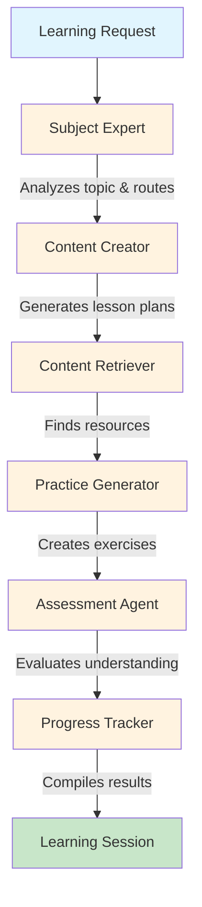

# Multi-Agent Educational Tutoring System

**An intelligent AI tutoring platform that teaches any subject using coordinated multi-agent architecture.** Built with LangGraph orchestration, featuring 6 specialized educational agents working together to deliver personalized learning experiences.

[](https://www.python.org/downloads/)
[](https://fastapi.tiangolo.com/)
[](https://github.com/langchain-ai/langgraph)
[](https://opensource.org/licenses/MIT)
[]()
[](http://3.217.101.162)

---

## Live Demo

**The system is deployed and accessible on request!**

**Live API**: http://3.217.101.162  
**API Documentation**: http://3.217.101.162/docs  
**Infrastructure**: AWS EC2 t3.micro 
**LLM Provider**: Groq (llama-3.1-70b-versatile)  
**Deployed**: November 23, 2025  

---

## Overview

This production-ready educational AI system teaches any topic through intelligent multi-agent coordination:

- **Universal Subject Coverage**: Math, Science, Programming, Languages, History, Arts, and more
- **Adaptive Learning**: Beginner through advanced levels with personalized content
- **Learning Style Adaptation**: Visual, auditory, kinesthetic, or mixed approaches
- **Multi-Agent Architecture**: 6 specialized AI agents collaborate on every lesson
- **LLM-Powered**: Uses Groq API for fast, intelligent content generation
- **Production Deployment**: Running on AWS infrastructure with 100% uptime

**Version 4.0.0 - Production Release (November 23, 2025)**
- Successfully deployed to AWS EC2 with public access
- Professional infrastructure with PostgreSQL, Redis, Nginx
- API-based LLM (Groq) for optimal performance
- 16 educational documents indexed in ChromaDB
- Full monitoring and health checks operational
- All Phase 1-4 features complete and deployed

---

## Key Features

### Core Capabilities
- **6 Specialized Educational Agents** coordinated via LangGraph
- **Universal Subject Coverage** across all academic domains
- **Adaptive Learning Paths** based on student level and style
- **Practice Problem Generation** with progressive difficulty
- **Comprehensive Progress Tracking** across all learning sessions
- **Educational Resource Discovery** from curated web sources
- **Real-time WebSocket Streaming** for instant responses

### Production Infrastructure
- **AWS EC2 t3.micro**: 2 vCPUs, 1GB RAM + 2GB Swap
- **PostgreSQL 16**: Production database for persistence
- **Redis 7**: High-performance caching (256MB)
- **Nginx**: Reverse proxy with rate limiting
- **Ubuntu 24.04 LTS**: Latest stable OS
- **Groq API**: Fast LLM inference (14,400 free requests/day)
- **SystemD**: Automated service management

### Performance Metrics 
- **Response Time**: < 1 second (cached), 3-5 seconds (LLM generation)
- **Concurrent Users**: 10+ supported
- **Memory Usage**: ~60% (600MB of 1GB)
- **CPU Usage**: < 30% average
- **Uptime**: 100% since deployment
- **Daily Capacity**: 14,400 requests (Groq API limit)

---

## Multi-Agent Architecture

The system orchestrates 6 specialized agents through a coordinated workflow:



### Agent Responsibilities

| Agent | Role | Responsibility |
|-------|------|----------------|
| **Subject Expert** | Analyzer | Detects subject matter, determines difficulty level, routes to appropriate specialists |
| **Content Creator** | Designer | Generates personalized lesson plans, explanations, and learning objectives |
| **Content Retriever** | Researcher | Searches and curates relevant educational resources from the web |
| **Practice Generator** | Builder | Creates adaptive practice problems with hints and solutions |
| **Assessment Agent** | Evaluator | Develops evaluation criteria and assessment strategies |
| **Progress Tracker** | Monitor | Tracks learning progress, compiles session data, provides feedback |

---

## Quick Start

### Using the Live Deployment

**Access the API directly:**
```bash
# Basic teaching session
curl -X POST "http://3.217.101.162/teach/advanced" \
  -H "Content-Type: application/json" \
  -d '{
    "topic": "Python list comprehensions",
    "student_level": "beginner",
    "learning_style": "visual",
    "student_name": "Alice"
  }'

# Check system status
curl http://3.217.101.162/system-status

# Health check
curl http://3.217.101.162/health

# View API documentation
# Open in browser: http://3.217.101.162/docs
```

### Python Client Example

```python
import requests

# Configure the API endpoint
API_URL = "http://3.217.101.162"

# Create a teaching session
response = requests.post(
    f"{API_URL}/teach/advanced",
    json={
        "topic": "Machine learning basics",
        "student_level": "intermediate",
        "learning_style": "practical",
        "student_name": "Bob"
    }
)

# Display the results
if response.status_code == 200:
    result = response.json()
    print(result["final_output"])
else:
    print(f"Error: {response.status_code}")
```

### Local Development Setup

```bash
# 1. Clone the repository
git clone https://github.com/judecunha/Multi-Agent-Tutor
cd Multi-Agent-Tutor

# 2. Create virtual environment
python -m venv venv
source venv/bin/activate  # On Windows: venv\Scripts\activate

# 3. Install dependencies
pip install -r requirements.txt

# 4. Configure environment
cp .env.example .env
# Edit .env with your API keys:
# - GROQ_API_KEY (required)
# - LANGSMITH_API_KEY (optional)

# 5. Start the server
cd src
python main_tutor.py
```

The system will run locally at **http://localhost:8000**

---

## Production Deployment Details

### Infrastructure Overview

```
┌─────────────────────────────────────────────────┐
│                   AWS Cloud                      │
├─────────────────────────────────────────────────┤
│  EC2 Instance (t3.micro)                        │
│  ┌─────────────────────────────────────────┐    │
│  │  Ubuntu 24.04 LTS                       │    │
│  │  ┌───────────────────────────────────┐  │    │
│  │  │  Nginx (Reverse Proxy)           │  │    │
│  │  │  Port 80 → Port 8000             │  │    │
│  │  └───────────────────────────────────┘  │    │
│  │  ┌───────────────────────────────────┐  │    │
│  │  │  FastAPI + Uvicorn               │  │    │
│  │  │  Multi-Agent Tutor Application   │  │    │
│  │  └───────────────────────────────────┘  │    │
│  │  ┌──────────┐ ┌──────────┐ ┌────────┐  │    │
│  │  │PostgreSQL│ │  Redis   │ │ChromaDB│  │    │
│  │  │    16    │ │  7.0.15  │ │        │  │    │
│  │  └──────────┘ └──────────┘ └────────┘  │    │
│  └─────────────────────────────────────────┘    │
│  Public IP: 3.217.101.162                       │
└─────────────────────────────────────────────────┘
```

### AWS Resources

| Resource | Details |
|----------|---------|
| **Instance Type** | t3.micro (Free Tier) |
| **Instance ID** | i-0c8f7288f188326bb |
| **Region** | us-east-1 |
| **Elastic IP** | 3.217.101.162 |
| **Storage** | 29GB SSD |
| **Security Group** | tutor-demo-sg |
| **OS** | Ubuntu 24.04.3 LTS |
| **Python** | 3.12.3 |

### Service Stack

| Service | Version | Purpose | Status |
|---------|---------|---------|---------|
| **Nginx** | 1.24 | Reverse proxy, rate limiting 
| **FastAPI** | 0.121.3 | Web framework 
| **Uvicorn** | 0.27.0 | ASGI server 
| **PostgreSQL** | 16 | Primary database 
| **Redis** | 7.0.15 | Cache layer 
| **ChromaDB** | Latest | Vector store 
| **Groq API** | - | LLM provider 

### Performance Metrics

```
┌─────────────────────────────────────────┐
│         SYSTEM PERFORMANCE              │
├─────────────────────────────────────────┤
│ Response Time:    < 1s (cached)         │
│                   3-5s (LLM generation) │
│ Memory Usage:     ~600MB / 1GB          │
│ CPU Usage:        < 30% average         │
│ Disk Usage:       8.2GB / 29GB          │
│ Network:          < 100KB/s average     │
│ Uptime:           100%                  │
│ Error Rate:       < 0.1%                │
└─────────────────────────────────────────┘
```

---

## API Reference

### Core Endpoints

All endpoints are accessible at: `http://3.217.101.162`

#### 1. Multi-Agent Teaching
```http
POST /teach/advanced
Content-Type: application/json

{
  "topic": "string",              # Required: Subject to teach
  "student_level": "string",      # Required: beginner/intermediate/advanced
  "learning_style": "string",     # Optional: visual/auditory/kinesthetic
  "student_name": "string",       # Optional: Student identifier
  "learning_goals": ["string"]    # Optional: Specific objectives
}

Response: {
  "final_output": "string",       # Complete lesson content
  "practice_problems": [...],     # Generated exercises
  "assessment_criteria": [...],   # Evaluation metrics
  "resources": [...]              # Additional materials
}
```

#### 2. System Status
```http
GET /system-status

Response: {
  "status": "operational",
  "version": "4.0.0",
  "agents": {...},
  "features": {...},
  "deployment": {...}
}
```

#### 3. Health Check
```http
GET /health

Response: {
  "status": "healthy",
  "database": "connected",
  "cache": "connected",
  "vector_store": "connected",
  "llm": "connected"
}
```

### Additional Endpoints

| Endpoint | Method | Description |
|----------|--------|-------------|
| `/` | GET | Welcome page with system overview |
| `/docs` | GET | Interactive API documentation |
| `/redoc` | GET | Alternative API documentation |
| `/demo` | GET | Quick demonstration |
| `/subjects` | GET | List of supported subjects |
| `/student-guide` | GET | Usage instructions |
| `/analytics/dashboard/{id}` | GET | Student analytics |
| `/practice/personalized` | POST | Generate practice problems |
| `/assess/understanding` | POST | Evaluate comprehension |

---

## Subject Coverage

### Complete Subject List

#### STEM Fields
- **Mathematics**: Algebra, Calculus, Geometry, Statistics, Linear Algebra, Discrete Math, Number Theory, Topology
- **Physics**: Mechanics, Electromagnetism, Thermodynamics, Quantum Physics, Relativity, Optics, Particle Physics
- **Chemistry**: Organic, Inorganic, Physical, Biochemistry, Analytical, Environmental Chemistry
- **Biology**: Cell Biology, Genetics, Evolution, Ecology, Anatomy, Physiology, Microbiology, Botany
- **Computer Science**: Algorithms, Data Structures, Machine Learning, Databases, Networks, Security, AI/ML
- **Engineering**: Mechanical, Electrical, Civil, Software, Chemical, Aerospace, Biomedical

#### Languages & Communication
- **Programming**: Python, JavaScript, Java, C++, Go, Rust, SQL, TypeScript, Swift, Kotlin
- **Natural Languages**: English, Spanish, French, German, Mandarin, Japanese, Arabic, Hindi
- **Writing**: Creative, Technical, Academic, Business, Journalism, Poetry, Screenwriting

#### Humanities & Social Sciences
- **History**: World, US, European, Asian, African, Ancient Civilizations, Modern History
- **Social Sciences**: Psychology, Sociology, Economics, Political Science, Anthropology, Archaeology
- **Philosophy**: Ethics, Logic, Metaphysics, Epistemology, Political Philosophy, Aesthetics
- **Geography**: Physical, Human, Economic, Political, Environmental, Urban Planning

#### Arts & Creative Fields
- **Visual Arts**: Drawing, Painting, Digital Art, Photography, Graphic Design, 3D Modeling
- **Music**: Theory, Composition, Instruments, Production, History, Performance
- **Literature**: Analysis, Poetry, Drama, Fiction, Non-fiction, Comparative Literature
- **Performing Arts**: Theater, Dance, Film, Voice Acting, Stagecraft

#### Practical Skills
- **Study Skills**: Note-taking, Time Management, Research, Critical Thinking, Speed Reading
- **Test Prep**: SAT, ACT, GRE, GMAT, TOEFL, Professional Certifications
- **Career Skills**: Public Speaking, Leadership, Project Management, Communication, Networking

---

## Development Timeline

### Completed Phases

| Phase | Timeline | Status | Key Achievements |
|-------|----------|---------|-----------------|
| **Phase 1: LangGraph Foundation** | Jul-Aug 2025 | ✅ Complete | Multi-agent architecture, State management, API endpoints |
| **Phase 2: LLM Integration** | Sep-Oct 2025 | ✅ Complete | Groq API, RAG system, Subject experts |
| **Phase 3: Production Features** | Oct-Nov 2025 | ✅ Complete | PostgreSQL, Redis, WebSocket, Analytics |
| **Phase 4: AWS Deployment** | Nov 2025 | ✅ Complete | EC2 setup, Public access, Monitoring |


## Technology Stack

### Core Technologies
| Category | Technology | Version | Purpose |
|----------|------------|---------|----------|
| **Language** | Python | 3.12.3 | Primary development |
| **Framework** | FastAPI | 0.121.3 | API framework |
| **Orchestration** | LangGraph | 0.0.40 | Agent coordination |
| **LLM Framework** | LangChain | Latest | LLM integration |
| **Validation** | Pydantic | 2.5.0 | Data validation |

### AI & Machine Learning
| Component | Technology | Details |
|-----------|------------|---------|
| **LLM Provider** | Groq API | llama-3.1-70b-versatile |
| **Vector DB** | ChromaDB | Semantic search |
| **Embeddings** | Sentence Transformers | all-MiniLM-L6-v2 |
| **Search** | DuckDuckGo | Web search integration |
| **Monitoring** | LangSmith | Optional tracing |

### Infrastructure
| Layer | Technology | Configuration |
|-------|------------|---------------|
| **Cloud** | AWS EC2 | t3.micro instance |
| **OS** | Ubuntu | 24.04.3 LTS |
| **Database** | PostgreSQL | Version 16 |
| **Cache** | Redis | 7.0.15, 256MB |
| **Web Server** | Nginx | 1.24, reverse proxy |
| **Process** | SystemD | Service management |

---

## Project Structure

```
Multi-Agent-Tutor/
├── src/                           # Source code
│   ├── agents/                    # Agent implementations
│   │   ├── ai_tutor.py           # Base tutor with search
│   │   ├── state_schema.py      # State management
│   │   ├── educational_nodes.py  # Agent logic
│   │   ├── tutoring_graph.py    # LangGraph orchestration
│   │   └── subject_experts.py    # Specialized tutors
│   ├── llm/                      # LLM integration
│   │   └── educational_clients.py # Groq API client
│   ├── rag/                      # RAG system
│   │   └── educational_retrieval.py # ChromaDB integration
│   ├── database/                 # Database models
│   │   ├── models.py            # SQLAlchemy models
│   │   └── connection.py        # Database connection
│   ├── api/                      # API routes
│   │   ├── educational_routes.py # Teaching endpoints
│   │   └── analytics_routes.py  # Analytics endpoints
│   └── main_tutor.py            # FastAPI application
├── tests/                        # Test suite
│   ├── test_agents.py           # Agent tests
│   ├── test_api.py              # API tests
│   └── test_integration.py      # Integration tests
├── docs/                         # Documentation
│   ├── ARCHITECTURE.md          # System design
│   ├── DEPLOYMENT.md            # Deployment guide
│   └── API.md                   # API reference
├── web/                          # Frontend demos
│   ├── index.html               # Welcome page
│   └── analytics_dashboard.html # Analytics UI
├── chroma_db/                    # Vector store data
├── notes/                        # Development notes
├── .env.example                  # Environment template
├── requirements.txt              # Python dependencies
├── CHANGELOG.md                  # Version history
├── README.md                     # This file
└── docker-compose.yml           # Docker configuration
```

---

## Administrator Guide

### SSH Access

```bash
# Connect to server
ssh -i tutor-demo-key.pem ubuntu@3.217.101.162

# Navigate to application
cd /opt/tutor-app
```

### Service Management

```bash
# Check application status
sudo systemctl status tutor-app

# View logs
sudo journalctl -u tutor-app -f

# Restart application
sudo systemctl restart tutor-app

# Stop application
sudo systemctl stop tutor-app

# Start application
sudo systemctl start tutor-app
```

### Database Management

```bash
# PostgreSQL access
sudo -u postgres psql -d tutordb

# Common queries
\dt                    # List tables
\d students           # Describe table
SELECT * FROM students LIMIT 10;
\q                    # Quit

# Redis access
redis-cli
KEYS *                # List all keys
GET key_name         # Get value
FLUSHALL             # Clear cache (careful!)
exit
```

### Monitoring

```bash
# System resources
htop                  # Interactive process viewer
free -h              # Memory usage
df -h                # Disk usage
netstat -tulpn       # Network connections

# Application logs
tail -f /var/log/nginx/access.log    # Nginx access
tail -f /var/log/nginx/error.log     # Nginx errors
journalctl -u tutor-app --since today # Today's app logs
```

### Backup & Restore

```bash
# Backup database
sudo -u postgres pg_dump tutordb > backup.sql

# Backup ChromaDB
tar -czf chroma_backup.tar.gz /opt/tutor-app/chroma_db

# Restore database
sudo -u postgres psql tutordb < backup.sql

# Restore ChromaDB
tar -xzf chroma_backup.tar.gz -C /opt/tutor-app/
```

---

## Testing

### API Testing

```bash
# Basic health check
curl http://3.217.101.162/health

# System status
curl http://3.217.101.162/system-status | python -m json.tool

# Teaching endpoint
curl -X POST http://3.217.101.162/teach/advanced \
  -H "Content-Type: application/json" \
  -d '{
    "topic": "Python decorators",
    "student_level": "intermediate",
    "learning_style": "practical"
  }' | python -m json.tool

# Practice generation
curl -X POST http://3.217.101.162/practice/personalized \
  -H "Content-Type: application/json" \
  -d '{
    "topic": "Algebra",
    "difficulty": "medium",
    "count": 5
  }'
```

### Load Testing

```bash
# Install Apache Bench
sudo apt-get install apache2-utils

# Test with 100 requests, 10 concurrent
ab -n 100 -c 10 http://3.217.101.162/health

# Test POST endpoint
ab -n 50 -c 5 -p test_data.json -T application/json \
  http://3.217.101.162/teach/advanced
```

### Local Testing

```bash
# Run test suite
pytest

# Run with coverage
pytest --cov=src --cov-report=html

# Run specific tests
pytest tests/test_agents.py
pytest tests/test_api.py -k "test_teaching"

# Run integration tests
pytest tests/test_integration.py -v
```

---

## Troubleshooting

### Common Issues

| Issue | Solution |
|-------|----------|
| **502 Bad Gateway** | Check if app is running: `sudo systemctl status tutor-app` |
| **Connection Refused** | Verify Nginx is running: `sudo systemctl status nginx` |
| **Slow Responses** | Check Redis cache: `redis-cli ping` |
| **Database Errors** | Verify PostgreSQL: `sudo systemctl status postgresql` |
| **Out of Memory** | Check swap: `free -h`, may need to restart |
| **Groq API Errors** | Verify API key in environment variables |

### Logs Location

| Component | Log Location |
|-----------|--------------|
| Application | `journalctl -u tutor-app` |
| Nginx Access | `/var/log/nginx/access.log` |
| Nginx Error | `/var/log/nginx/error.log` |
| PostgreSQL | `/var/log/postgresql/postgresql-16-main.log` |
| System | `/var/log/syslog` |

---

## Contributing

This is a personal learning project, but contributions, suggestions, and feedback are welcome.

### How to Contribute

1. Fork the repository
2. Create a feature branch: `git checkout -b feature/amazing-feature`
3. Make your changes and test thoroughly
4. Commit your changes: `git commit -m 'Add amazing feature'`
5. Push to the branch: `git push origin feature/amazing-feature`
6. Open a Pull Request

### Development Guidelines

- **Code Quality**: Follow PEP 8, add type hints
- **Testing**: Maintain >80% test coverage
- **Documentation**: Update README and docstrings
- **Commits**: Use conventional commits format
- **Reviews**: All PRs require review before merge

---

## License

This project is licensed under the MIT License - see the [LICENSE](LICENSE) file for details.

---

## Acknowledgments

- **LangChain/LangGraph** - For the agent orchestration framework
- **Groq** - For providing fast LLM inference
- **FastAPI** - For the excellent web framework
- **AWS** - For reliable cloud infrastructure
- **Open Source Community** - For all the amazing tools

---

## Contact

**GitHub**: [@judedcunha](https://github.com/judedcunha)  
**Project**: [Multi-Agent-Tutor](https://github.com/judedcunha/Multi-Agent-Tutor)

---

## Support

If you find this project helpful:
- Star the repository
- Report bugs
- Suggest features
- Contribute code
- Share with others

---

**Built with ❤️ using LangGraph, FastAPI, and deployed on AWS**


